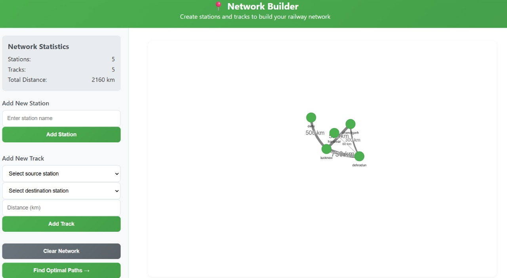
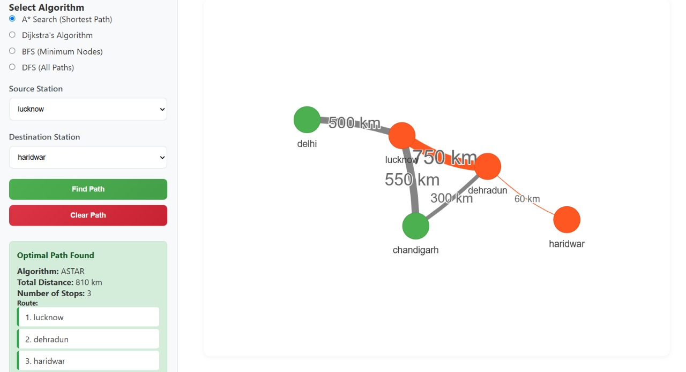
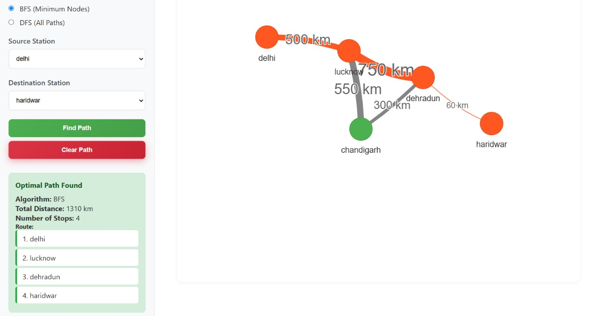

# Railway Network Optimization Project

A Data Structures & Algorithms-based project to simulate and optimize railway network operations including network design and route planning.

---

## 📌 Features

### 🔹 Design your network
- **Design** network using simple UI to add stations and tracks between them.  
  

---

### 🔹 Path Optimization

- **Shortest Path** between two stations using Dijkstra’s or A* Search.  
    
  

- **Path Covering Minimum Nodes** to explore more stops on a journey.  
  

- **All Possible Paths** for analyzing travel flexibility.

---

## ⚙️ Technologies Used

- **Language:** C++, HTML, CSS,JS
- **Graph Algorithms:** Dijkstra’s, DFS, BFS, 
- **Data Structures:** Adjacency List

---

## Suggestions
- I would love to receive any suggestions/changes that can help this project become better.
